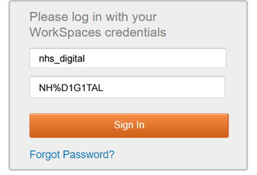
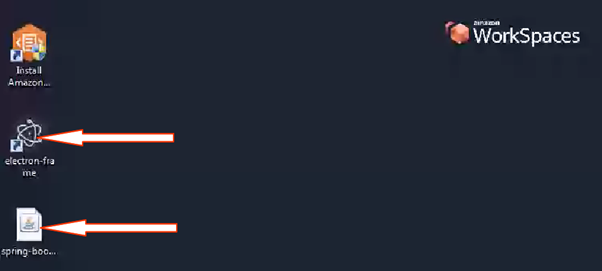
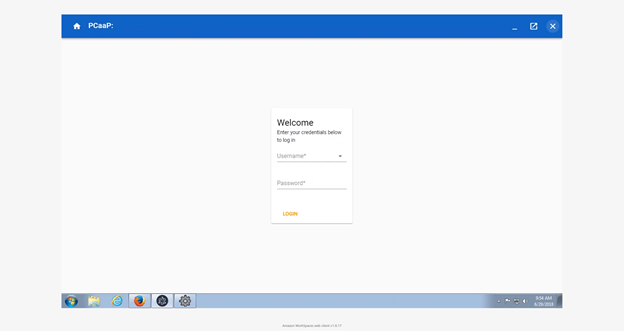
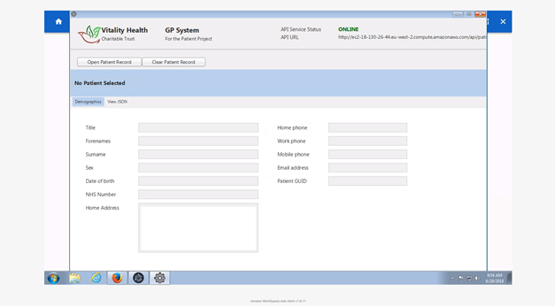
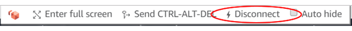

# frame
## Developers notes
#### To compile and run the framework application...
- Ensure [Node.js](https://nodejs.org/en/) is installed and set-up on your machine
- Clone the [frame repository](https://github.com/gpit-futures/frame.git) using git clone (or your favourite GUI tool) using the URL https://github.com/gpit-futures/frame.git to an appropriate local directory.
- Open your chosen console (Node.js Command Prompt/Git-Bash/etc.).
- Navigate to {downloaded location/frame/electron-frame} and run the following commands:
- - npm install
- - npm install electron-forge
- - electron-forge start - (To start the application locally.)
- - electron-forge make - (To compile an executable for your enviroment. After compilation, the executable can be found in the "/out/make directory".)
- precompiled executables for windows/mac can be found [here](https://github.com/gpit-futures/frame/releases)
#### Back end to be completed by Rowell
### Dependencies
- A working version of the [core module](https://github.com/gpit-futures/pulse) and any other modules:
- - [inr module](https://github.com/gpit-futures/inr)
- - [appointment module](https://github.com/gpit-futures/gpconnect-demonstrator)
- A working [authentication server](https://github.com/gpit-futures/auth-server)
- A working [rabbit server](https://github.com/rabbitmq/rabbitmq-server/releases)
#### Back end to be completed by Rowell
### Configuration
#### Front end to be completed by Dan
#### Back end to be completed by Rowell
## Installation notes
To install the framework directly as an executable file simply download the [latest version](https://github.com/gpit-futures/frame/releases) from Git Hub - note, that in order to show the communication between the systems, download the [thick-client](https://github.com/gpit-futures/thick-client/releases) as well.  
## Demonstrator notes
### Accessing PCaaP PoC Demonstrator via a web-browser
- The demonstrator is available by navigating to [https://clients.amazonworkspaces.com/webclient](https://clients.amazonworkspaces.com/webclient)
- - Enter the following registration code and click the &#39;Register&#39; button; **Registration code: wsdub+9SHUU8**

- - Enter the following credentials and click the &#39;Sign In&#39; button.
**Username: nhs\_digital**
**Password: NH%D1G1TAL**

- Access is granted to the system and the desktop should now be visible in the browser.

- Initialise the system by double clicking the icons indicated below;

- - Electron: To initialise the Web Application (To use web version of core system)

- - Spring Boot: To initialise the Thick Client Application (To use desktop version of core system)

- To login as either user on the web application, the password is &#39;password&#39;.
- Before closing the demonstrator, please ensure after use that **both application windows are closed before logging out.**
- On closing the demonstrator, please select &#39;Disconnect&#39; from top navigation bar.

